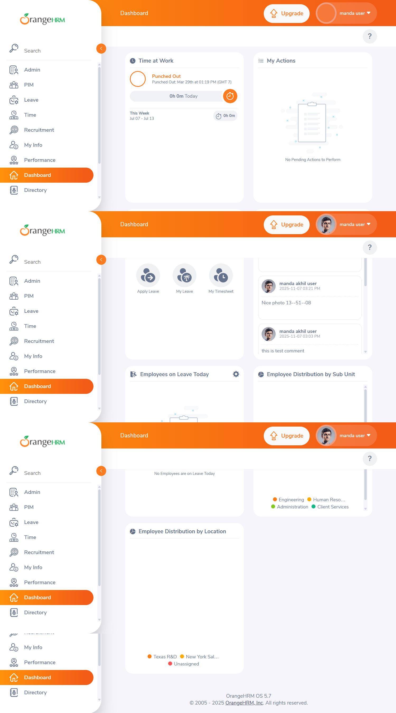
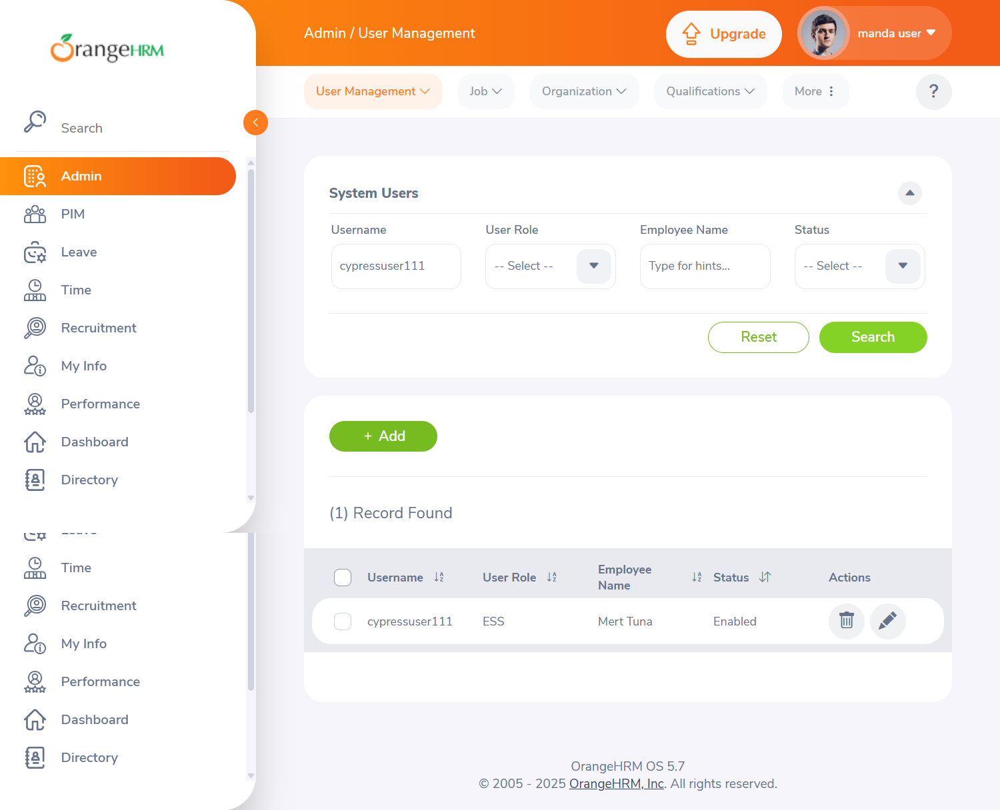
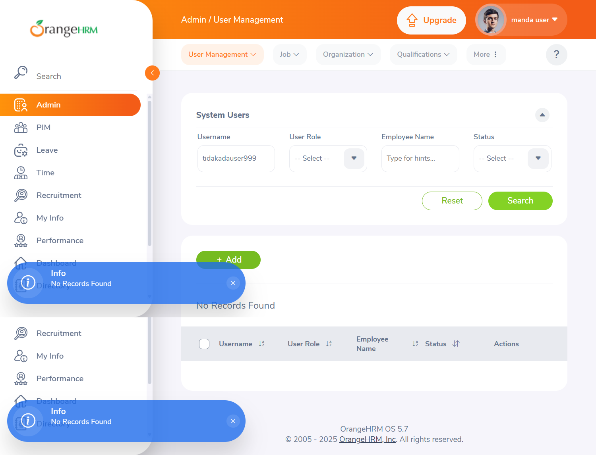
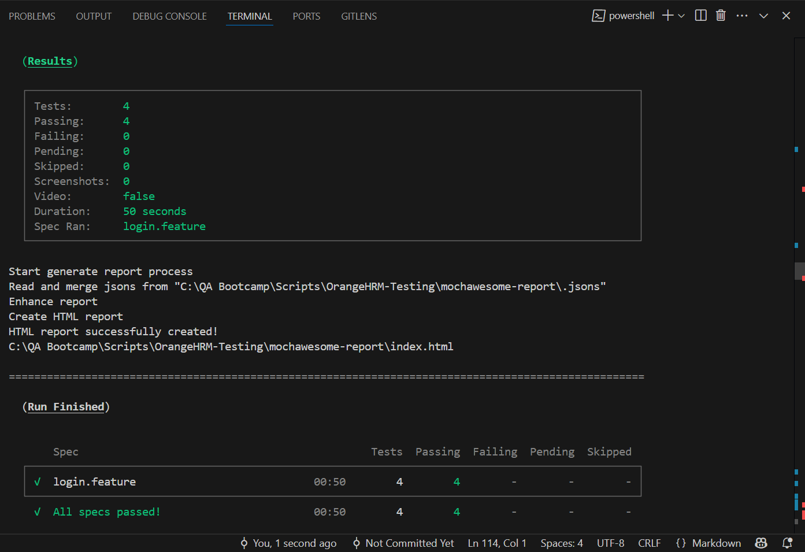

# BDD + Cypress Web Automation

Are you familiar with Automation Testing?
If yes, create an automation script using any framework of your choice for the following scenario:
• Go to [https://opensource-demo.orangehrmlive.com](https://opensource-demo.orangehrmlive.com)
• Enter all required fields and add a new admin (cover only positive cases)

---

## 🔧 Automation written in JavaScript leveraging:

* **Cypress**
* **Cucumber (BDD with Gherkin)**
* **Page Object Model (POM)**
* **Mocha (default via Cypress)**

---

## Test Environments

* Dashboard
* Admin Management Page

---

## ⚙️ Prerequisites

* Node.js installed on your machine

---

## 🔐 Credentials (OrangeHRM Demo):

```json
{
  "username": "Admin",
  "password": "admin123"
}
```

You can store this as `cypress.env.json` if needed.

---

## 📂 Project Structure

To ensure a well-organized structure, the project is split into three main folders:

### 🗂 Feature

Contains `.feature` files written in Gherkin syntax. These files describe the system behavior in a human-readable way and help bridge communication between developers, testers, and stakeholders.

### 🧱 Pages

Houses the Page Object Model (POM) classes. Each file represents a page/component of OrangeHRM with related actions (e.g., login, add admin, search user, etc.).

### 🪾 Step Definitions

Implements each Gherkin step using Cypress commands. Acts as the glue between the `.feature` file and the actual test logic.

---

## ▶️ How to Run Tests

### 1. Clone This Project

```bash
git clone https://github.com/kiarraafinathannia/OrangeHRM-Testing.git
cd OrangeHRM-Testing
```

### 2. Install Dependencies

```bash
npm install
```

### 3. Run with Cypress GUI

```bash
npx cypress open
```

Select a feature file to execute the tests interactively.

### 4. Run in Headless Mode

```bash
npm run headless
```

Runs the test without opening the Cypress GUI.

---

### 📸 Cypress GUI Results

#### Login Successful


#### Add Admin Success



#### Search Admin - Not Found


## 🧪 Headless Test Result




## 📈 Results

* Screenshots and videos automatically saved on test failure
* Optionally integrated with Allure (can be added)

---

## 📝 Example Scenario

```gherkin
Scenario Outline: Add new admin user
  Given user is logged in as "<username>" with "<password>"
  And user navigates to Admin page
  When user adds a new admin "<newUsername>" with role "<role>" and employee name "<name>" with password "<userPassword>"
  Then the admin "<newUsername>" should appear in the user list
```

---

## 🚨 Findings

* Autocomplete input fields for employee name are highly dynamic and may require wait/assertions
* The success toast after creating a user disappears quickly; assert via search instead

---
